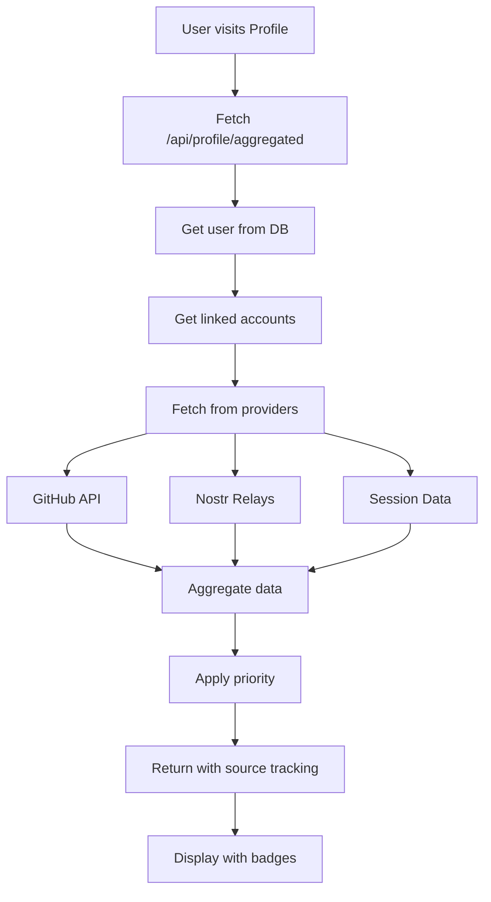
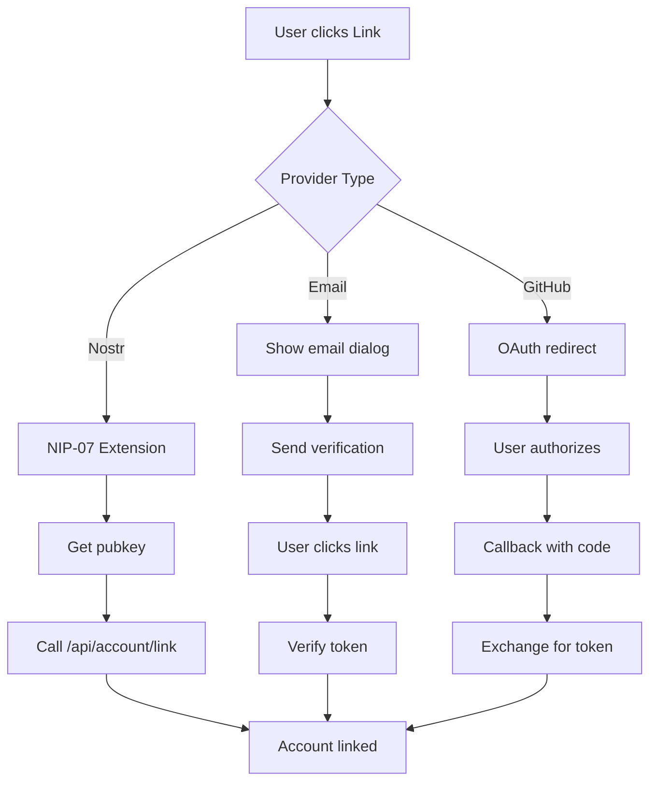

# Profile & Settings Implementation Reference

## System Overview

The profile and settings system provides a comprehensive multi-account management solution that allows users to link multiple authentication providers (Nostr, GitHub, Email) while maintaining control over their data authority and profile source preferences.

## Key Features

### 1. Multi-Provider Account Linking
- **Nostr**: Via NIP-07 browser extension
- **Email**: With verification flow  
- **GitHub**: OAuth 2.0 integration
- **Recovery**: Private key restore (Nostr-first; not a linkable provider in UI)
- Prevents duplicate linking
- Current provider auto-disabled

### 2. Profile Data Aggregation
- Fetches data from all linked accounts
- Applies priority based on user preferences
- Shows data source with visual badges
- Real-time API fetching for fresh data

### 3. Intelligent Settings Management
- OAuth-first users can edit basic fields
- Nostr-first users have read-only basic fields
- Enhanced fields editable by all users
- Profile source configuration

### 4. Cross-Provider Sync
- Manual sync from linked providers (GitHub/Nostr/Email)
- GitHub/Nostr fetch live data; email sync backfills `User.email` when missing or mismatched
- Updates local profile
- Respects data priority
- `simple-settings` calls `/api/account/sync` (token-aware); `enhanced-settings` calls `/api/profile/sync` (profileSource-aware)

## Component Structure

```
/src/app/profile/
├── page.tsx                              # Profile page with tabs
├── actions.ts                            # Server actions
└── components/
    ├── enhanced-profile-display.tsx     # Profile tab UI
    ├── simple-settings.tsx               # Settings tab UI (compact)
    ├── enhanced-settings.tsx             # Settings tab UI (full)
    ├── profile-edit-forms.tsx            # Edit forms + dispatchProfileUpdatedEvent
    └── profile-tabs.tsx                  # Tab navigation

/src/components/account/
└── linked-accounts.tsx                   # Account linking UI

/src/lib/
├── profile-aggregator.ts                 # Data aggregation logic
├── account-linking.ts                    # Linking utilities
└── auth.ts                               # Authentication config

/src/app/api/
├── profile/
│   ├── aggregated/                       # Aggregated profile endpoint
│   ├── content/                          # Published content + stats
│   ├── nostr/                            # Nostr profile fetch
│   └── sync/                             # Profile-aware sync
└── account/
    ├── linked/                           # Get linked accounts
    ├── link/                             # Link new account
    ├── unlink/                           # Unlink account
    ├── preferences/                      # Account preferences
    ├── primary/                          # Change primary provider
    ├── sync/                             # Token-aware provider sync
    ├── link-oauth/                       # OAuth initiation
    ├── oauth-callback/                   # OAuth completion
    ├── send-link-verification/           # Send email with ref+code
    └── verify-email/                     # POST: Complete email link
```

## Data Flow Architecture

### Profile Display Flow



### Account Linking Flow



## Implementation Details

### Profile Aggregation Logic

The profile aggregator (`/src/lib/profile-aggregator.ts`) implements intelligent data merging:

```typescript
// Priority determination
const isNostrFirst = isNostrFirstProfile(user.profileSource, user.primaryProvider)

// Priority order
const prioritizedAccounts = isNostrFirst
  ? [...nostrAccounts, currentData, ...nonNostrAccounts]
  : [currentData, ...nonNostrAccounts, ...nostrAccounts]

// Field aggregation
for (const account of prioritizedAccounts) {
  const source = account.provider === 'current' ? 'profile' : account.provider
  if (account.data.name && !aggregated.name) {
    aggregated.name = { 
      value: account.data.name, 
      source
    }
  }
  // ... other fields
}
```

### Settings Component

The simplified settings (`simple-settings.tsx`) provides focused functionality:

```typescript
const derivedProfileSource = preferences.profileSource || (!user.privkey ? 'nostr' : 'oauth')
const derivedPrimaryProvider = preferences.primaryProvider || session.provider || ''

type AccountType = 'anonymous' | 'nostr' | 'oauth'
const accountType: AccountType =
  derivedPrimaryProvider === 'anonymous'
    ? 'anonymous'
    : derivedProfileSource === 'nostr'
      ? 'nostr'
      : 'oauth'

const canEditBasic = accountType === 'oauth'
const requiresNostrExtension = accountType === 'nostr' && !user.privkey
```

Rendered behavior:
- `BasicProfileForm` only appears when `canEditBasic` is true (OAuth-first users).
- Everyone sees enhanced fields, but Nostr-first accounts must submit a signed kind 0 event (NIP-07) to publish updates to relays.
- Account badges surface `Anonymous / Nostr-First / OAuth-First` using the derived state so that UI stays aligned with automatic promotions.

### Account Linking Security

Email verification uses a lookup ref + 6-digit code stored in `VerificationToken` (identifier `link:${userId}:${email}`). The email contains the code **and** a link to `/verify-email?ref=...`. Codes are single-use and expire after 60 minutes.

```typescript
const code = crypto.randomInt(100000, 1000000).toString() // 6-digit code (cryptographically secure)
const lookupId = crypto.randomBytes(8).toString('hex')
const expires = new Date(Date.now() + 3600000)

await prisma.verificationToken.create({
  data: {
    identifier: `link:${userId}:${email}`,
    token: code,
    lookupId,
    expires
  }
})
```

The verification page is implemented at `src/app/verify-email/page.tsx` and posts `{ ref, token }` to `/api/account/verify-email`, which validates, rate-limits, and deletes tokens on success or expiry.

#### Rate Limits
- `/api/account/verify-email`: 5 attempts per ref per hour
- `/api/account/send-link-verification`: 3 emails per address per hour

### Real-Time Identity Refresh

- `src/lib/profile-events.ts` exports `PROFILE_UPDATED_EVENT`; client components dispatch it after link/unlink or profile edits.
- The header (`src/components/layout/header.tsx`) listens for that event, refetches `/api/profile/aggregated`, and updates cached avatar/display name.
- `LinkedAccountsManager` and `ProfileEditForms` call `dispatchProfileUpdatedEvent` to keep UI components in sync without full-page reloads.

**Note:** This uses DOM custom events which only propagate within a single browser tab. Other open tabs will see updated data on their next page load or mount, but won't receive real-time updates. Cross-tab sync (via `BroadcastChannel` or `storage` events) is not currently implemented.

### Provider Data Fetching

Each provider has specific fetch logic:

```typescript
// GitHub
async function fetchGitHubProfile(accessToken: string) {
  const response = await fetch('https://api.github.com/user', {
    headers: { 'Authorization': `Bearer ${accessToken}` }
  })
  return response.json()
}

// Nostr (uses centralized relay config, src/lib/nostr-profile.ts)
async function fetchNostrProfile(pubkey: string) {
  const relays = getRelays('profile')  // from src/lib/nostr-relays.ts
  const relayPool = new RelayPool(relays)
  const event = await relayPool.get(
    relays,
    { kinds: [0], authors: [pubkey] },
    { timeout: 5000 }
  )
  return event ? JSON.parse(event.content) : null
}
```

## UI/UX Patterns

### Visual Provider Indicators

Every field shows its data source:

```tsx
<div className="flex items-center gap-2">
  <span>Name: {profile.name?.value}</span>
  <Badge variant="outline">
    <GitHub className="h-3 w-3" />
    GitHub
  </Badge>
</div>
```

### Loading States

Skeleton UI during data fetching:

```tsx
{loading ? (
  <Skeleton className="h-64 w-full" />
) : (
  <ProfileContent />
)}
```

### Toast Notifications

User feedback for all operations:

```tsx
toast({
  title: 'Account Linked',
  description: 'GitHub account linked successfully'
})
```

### Disabled State with Tooltip

Current provider indication:

```tsx
<TooltipProvider>
  <Tooltip>
    <TooltipTrigger asChild>
      <Button disabled>Link GitHub</Button>
    </TooltipTrigger>
    <TooltipContent>
      You are currently signed in with GitHub
    </TooltipContent>
  </Tooltip>
</TooltipProvider>
```

## Configuration Options

### Profile Source Priority

Users can configure data priority:

```typescript
enum ProfileSource {
  NOSTR = 'nostr',   // Nostr data takes precedence
  OAUTH = 'oauth'    // OAuth data takes precedence
}
```

### Primary Provider

Determines main authentication:

```typescript
interface UserPreferences {
  primaryProvider: string    // 'github' | 'nostr' | 'email' | 'anonymous' | 'recovery' | 'current'
  profileSource: ProfileSource
}
```

## Testing Notes

- Unit tests exist for account-linking helpers in `src/lib/tests/account-linking.test.ts`.
- Profile aggregation tests in `src/lib/tests/profile-aggregator.test.ts` (tests for `getAggregatedProfile`).
- Profile sync API tests in `src/app/api/tests/profile-sync.test.ts` (tests for `/api/profile/sync` route).
- Manual smoke checks recommended: link/unlink providers, email verify flow, GitHub OAuth link, `/api/account/sync`, and `/api/profile/sync`.

## Troubleshooting

### Common Issues

#### 1. GitHub OAuth redirect_uri error
**Problem**: GitHub app not configured for callback URL
**Solution**: Add `/api/account/oauth-callback` to GitHub app settings or use separate app with `GITHUB_LINK_CLIENT_ID`

#### 2. Email verification not working
**Problem**: Email server not configured
**Solution**: Set Nodemailer vars `EMAIL_SERVER_HOST`, `EMAIL_SERVER_PORT`, `EMAIL_SERVER_USER`, `EMAIL_SERVER_PASSWORD`, `EMAIL_SERVER_SECURE`, and `EMAIL_FROM`.

#### 3. Nostr profile not syncing
**Problem**: Relays not responding
**Solution**: Check relay connectivity for the relays returned by `getRelays('profile')` (configured in `config/nostr.json`). The `fetchNostrProfile` function in `src/lib/nostr-profile.ts` uses this centralized config.

#### 4. Profile data not updating
**Problem**: No new data available or provider API throttling
**Solution**: Use the Sync buttons in Settings; GitHub requests include retry/backoff and 429 handling. There is no server cache for `/api/profile/aggregated` currently.

## Performance Considerations

### Caching Strategy
- No server-side cache for `/api/profile/aggregated` today.
- Header caches avatar/name in localStorage and refreshes on `profile:updated`.
- GitHub fetches include retry/backoff + 429 handling inside `fetchGitHubProfile`.

### Query Optimization
- Batch fetch linked accounts
- Provider API calls are sequential per account in `getAggregatedProfile`
- Minimal database queries

## Security Best Practices

### Input Validation
- Zod schemas on account/profile endpoints
- Email format validation
- URL validation for banner updates

### Authentication
- Session required for all operations
- CSRF protection via NextAuth
- Secure token generation

### Data Protection
- No private keys in responses
- Rate limiting on email verification endpoints (see `src/lib/rate-limit.ts`)
- Ephemeral privkeys are stored encrypted at rest (`PRIVKEY_ENCRYPTION_KEY`)
